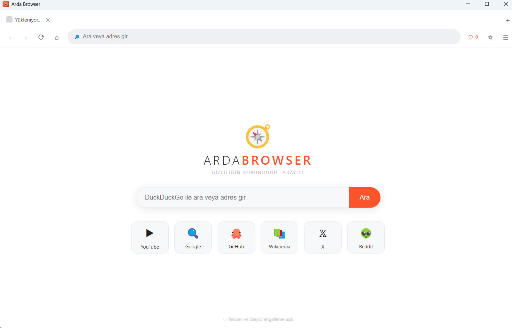
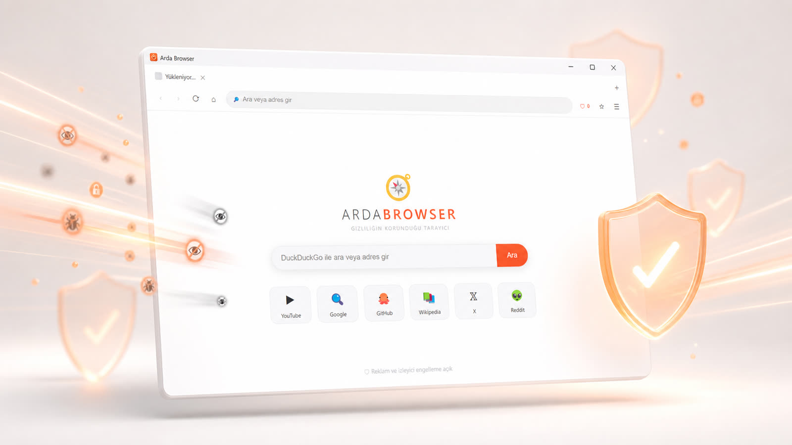
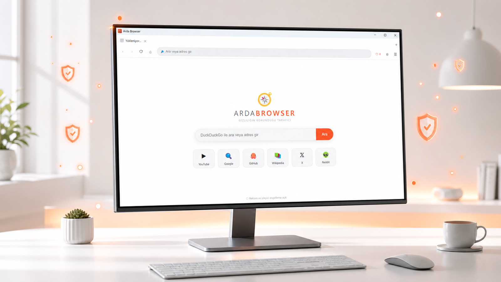
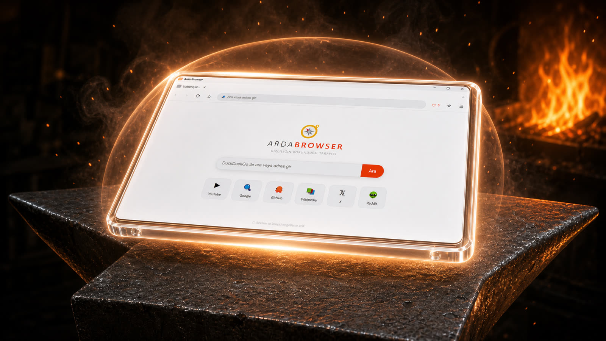

# Arda Browser

**Arda Browser**, hızlı ve sade bir internet deneyimi sunmak için Electron ve
Chromium üzerine geliştirilmiş ücretsiz bir Windows tarayıcısıdır.

**Güncel sürüm: v1.0.13 (Windows ve Android)**

[⬇️ Windows v1.0.13 kurulumunu indir](https://github.com/ardas121/arda-browser/releases/download/v1.0.13/Arda-Browser-Setup.exe)

[📱 Android v1.0.13 APK'yı indir](https://github.com/ardas121/arda-browser/releases/download/v1.0.13/ArdaBrowser-v1.0.13.apk)

## Özellikler

- 🗂️ Çoklu sekme desteği
- 🔎 Adres çubuğundan arama yapma
- 🛡️ Geliştirilmiş tam reklam, izleyici, açılır reklam ve sayfa içi reklam engelleme
- 🕶️ Ayrı oturum kullanan gizli sekmeler
- ⭐ Yer imleri ve yer imi çubuğu
- 🕘 Geçmişi görüntüleme ve temizleme
- ⬇️ Gerçek yüzde, boyut, hız ve kalan süre gösteren indirme yöneticisi
- ⏸️ İndirmeleri duraklatma, devam ettirme, iptal etme ve dosyayı açma
- 🔍 Sayfa içinde arama (`Ctrl+F`)
- ⚙️ Arama motoru ve Shields ayarları
- 🌐 Araç çubuğundan seçilebilen 12 arayüz dili
- ⌨️ Kullanışlı klavye kısayolları

### Desteklenen diller

Türkçe, English, Deutsch, Français, Español, Português, Русский, العربية,
中文, 日本語, 한국어 ve हिन्दी.

## Klavye kısayolları

| İşlem | Kısayol |
|---|---|
| Yeni sekme | `Ctrl+T` |
| Sekmeyi kapat | `Ctrl+W` |
| Adres çubuğuna git | `Ctrl+L` |
| Sayfayı yenile | `Ctrl+R` |
| Gizli sekme aç | `Ctrl+Shift+N` |
| Sayfada bul | `Ctrl+F` |
| İndirilenler | `Ctrl+J` |
| Yazdır | `Ctrl+P` |
| Sayfayı kaydet | `Ctrl+S` |
| Tarama verilerini sil | `Ctrl+Shift+Delete` |
| Tam ekran | `F11` |

## Tanıtım görselleri

| Gerçek Arda Browser arayüzü | Gizlilik ve koruma |
|---|---|
|  |  |



## Tanıtım videoları

[](https://ardas121.github.io/arda-browser/assets/arda-browser-dovme-animasyon.mp4)

- [Müzik ritmine senkronize dövme animasyonunu izle](https://ardas121.github.io/arda-browser/assets/arda-browser-dovme-animasyon.mp4)
- [Kısa Arda Browser tanıtımını izle](https://ardas121.github.io/arda-browser/assets/arda-browser-tanitim.mp4)

## Kurulum

1. [Windows v1.0.13 sürümünü indirin](https://github.com/ardas121/arda-browser/releases/download/v1.0.13/Arda-Browser-Setup.exe).
2. `Arda-Browser-Setup.exe` dosyasını çalıştırın.
3. Kurulum konumunu seçerek işlemi tamamlayın.

> Windows SmartScreen, uygulama henüz dijital olarak imzalanmadığı için ilk
> çalıştırmada uyarı gösterebilir.

## Google ile oturum açma

Google giriş sayfaları Arda Browser içinde açılır ve başka bir tarayıcıya otomatik
olarak yönlendirilmez. Arda Browser yalnızca Google giriş alanında Firefox uyumluluk
kimliğini kullanır ve giriş tamamlanınca normal Chromium kimliğine döner. Google'ın
hesap bazlı güvenlik politikası nedeniyle bazı hesaplarda giriş yine reddedilebilir.

## Kaynak koddan çalıştırma

Bilgisayarınızda [Node.js](https://nodejs.org/) kurulu olmalıdır.

```bash
npm install
npm start
```

Windows kurulum dosyasını oluşturmak için:

```bash
npm run dist
```

Oluşturulan kurulum dosyası `dist/Arda-Browser-Setup.exe` yolunda bulunur.

## Kullanılan teknolojiler

- Electron
- Chromium
- Node.js
- HTML, CSS ve JavaScript

## Lisans

Copyright © 2026 Arda Browser. All Rights Reserved.

Bu yazılım yalnızca kişisel kullanım için indirilebilir ve kullanılabilir. Kaynak kodun yazılı izin olmadan kopyalanması, değiştirilmesi, yeniden dağıtılması, tersine mühendisliği, alt lisanslanması veya ticari kullanımı yasaktır. Ayrıntılar için [LICENSE](LICENSE) dosyasına bakın.

## Contributors

- **Arda** — Proje sahibi ve geliştirici
- **Claude** — Geliştirme desteği
- **Codex (OpenAI)** — Geliştirme, test ve sürüm desteği

---

Made with ❤️ by **Arda**
